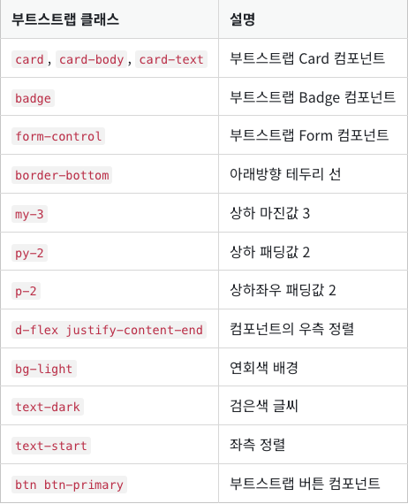
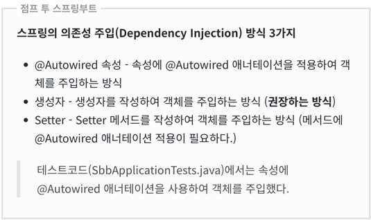

# Spring Boot 공부내용 정리

- ORM(Object-Relation Mapping): 자바 코드로 쿼리문 작성(내용 작성 시 쿼리문 일관성 부여)
- JPA(Java Presistent API): ORM 구현에 사용되는 인터페이스 모음

### - html, css, js관련
#### *HTML
#### *CSS
* 부트스트랩 클래스들: 
  class="container my-3", class="table", class="table-dark   

#### *JS

### - Annotations
(l): lombok
- @ResponseBody: return값을 그대로 웹페이지에 출력
- (l)@Entity
- (l)@Column: 릴레이션의 컬럼 관련내용 설정 가능(컬럼명, 타입 등)
- (l)@GeneratedValue: AUTO_INCREMENT와 동일
- (l)@Autowired: 테스트 코드에서 객체를 주입하기 위해 사용하는 어노테이션
  - 순환참조 문제 등의 이유로 실제 코드 작성시에는 생성자를 통한 객체 주입방식을 권장
- (l)@RequiredArgsConstructor: final(상수)이 붙은 속성을 포함하는 생성자를 자동으로 생성
  - **스프링 의존성 주입 규칙** 에 의해 questionRepository 객체가 자동으로 주입됨.

*스프링 의존성 주입 방식

### Thymeleaf에서는... 
* 문자열 연결시 "|" 사용
* href를 사용해 url 주소를 나타낼 떄에는 "@{"와 "}" 사이에 입력해야 함
  ()

**2023.12.04(Mon)**
* 2-10까지 구현 완료
* 이후 시작 지점: https://wikidocs.net/161357

**2023.12.05(Tue)**
